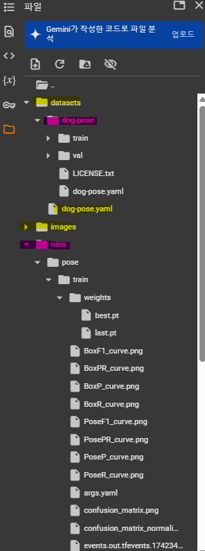
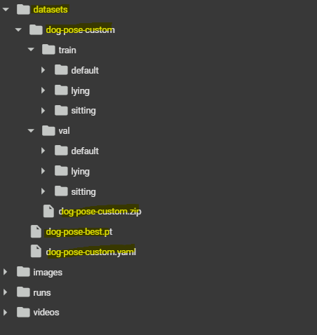

## **1. dog-pose**

### 1.1 원본 데이터 Tree 구조
#### [**dog-pose.zip** Download ⬇️](https://github.com/ultralytics/assets/releases/download/v0.0.0/dog-pose.zip)
```plaintext
dog-pose/
  │  dog-pose.yaml
  │  LICENSE.txt
  │
  ├─train
  │  ├─images
  │  │      n02085620_199.jpg
  │  │      n02085620_7.jpg
  │  │
  │  └─labels
  │          n02085620_199.txt
  │          n02085620_7.txt
  │
  └─val
      ├─images
      │      n02085620_500.jpg
      │      n02085620_712.jpg
      │
      └─labels
              n02085620_500.txt
              n02085620_712.txt
```
### 1.2 Google Colab 환경 세팅
 
#### [**dog-pose.yaml** Github🔗](https://github.com/ultralytics/ultralytics/blob/main/ultralytics/cfg/datasets/dog-pose.yaml)
#### **<span style="color: yellow;">dog-pose.yaml</span>**
```yaml
# Ultralytics 🚀 AGPL-3.0 License - https://ultralytics.com/license

# Dogs dataset http://vision.stanford.edu/aditya86/ImageNetDogs/ by Stanford
# Documentation: https://docs.ultralytics.com/datasets/pose/dog-pose/
# Example usage: yolo train data=dog-pose.yaml
# parent
# ├── ultralytics
# └── datasets
#     └── dog-pose  ← downloads here (337 MB)

# Train/val/test sets as 1) dir: path/to/imgs, 2) file: path/to/imgs.txt, or 3) list: [path/to/imgs1, path/to/imgs2, ..]
path: ../datasets/dog-pose # dataset root dir
train: train # train images (relative to 'path') 6773 images
val: val # val images (relative to 'path') 1703 images

# Keypoints
kpt_shape: [24, 3] # number of keypoints, number of dims (2 for x,y or 3 for x,y,visible)

# Classes
names:
  0: dog

# Download script/URL (optional)
download: https://github.com/ultralytics/assets/releases/download/v0.0.0/dog-pose.zip
```
<br/><br/>

## **2. dog-pose-custom**

### 2.1 커스텀 데이터 Tree 구조
```plaintext
dog-pose-custom/
  │  dog-pose-custom.yaml
  │
  ├── train/
  │   ├── default/
  │   │   ├── images/
  │   │   │      image001.jpg
  │   │   │      image002.jpg
  │   │   └── labels/
  │   │          image001.txt
  │   │          image002.txt
  │   ├── sitting/
  │   │   ├── images/
  │   │   │      image003.jpg
  │   │   └── labels/
  │   │          image003.txt
  │   └── lying/
  │       ├── images/
  │       │      image004.jpg
  │       └── labels/
  │              image004.txt
  └── val/
      ├── default/
      │   ├── images/
      │   └── labels/
      ├── sitting/
      │   ├── images/
      │   └── labels/
      └── lying/
          ├── images/
          └── labels/
```

### 2.2 Google Colab 환경 세팅

#### **<span style="color: yellow;">dog-pose-custom.yaml</span>**
```yaml
# Custom Dog Pose Dataset YAML

# Dataset root directory
path: ../datasets/dog-pose-custom  # 데이터셋의 루트 디렉토리

# Train dataset (여러 개의 폴더를 리스트로 추가)
train:
  - train/default
  - train/sitting
  - train/lying

# Validation dataset (여러 개의 폴더를 리스트로 추가)
val:
  - val/default
  - val/sitting
  - val/lying

# Keypoints
kpt_shape: [24, 3]  # (24개의 키포인트, x,y,가시성)

# Classes
names:
  0: default
  1: sitting
  2: lying

# (옵션) 다운로드 URL은 커스텀 데이터셋인 경우 필요없을 수 있음.
# download: <필요한 경우 URL을 추가>
```